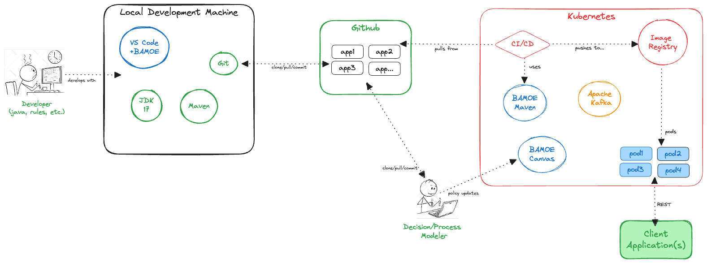
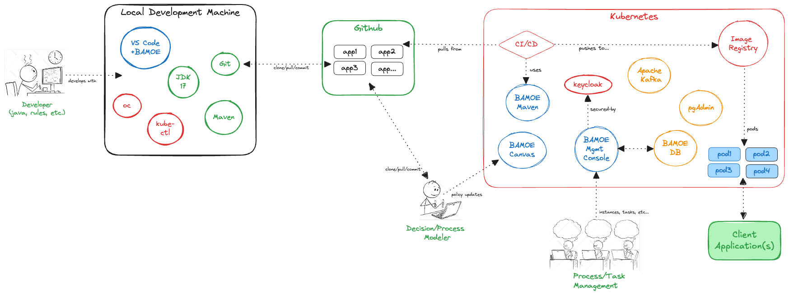

# IBM Business Automation Manager Open Editions - Setup Instructions
This repository contains all the necessary scripts, configuration files, and other resources necessary to setup BAMOE v9.x.

## Overview
This repository creates the necessary infrastructure services for a typical BAMOE implementation, as represented by the following diagram(s):

### Setup for Decisions (DMOE)
You will notice from the diagram below, there are only minimal infrastructure services required for DMOE applications.  You can choose to deploy `Maven` either a a container image or into your local `Artifactory` server as an off-line repository, or both.  If you wish to provide visual modeling capabilities to your developers or users, you can choose to deploy `BAMOE Canvas`.  No database or consoles are needed for decisions, however you can configure `Kafka` if your use cases include event-based decisioning.

### Setup for Process (PAMOE)
You will notice from the diagram below, there are additional infrastructure services required for PAMOE applications.  You can choose to deploy `Maven` either a a container image or into your local `Artifactory` server as an off-line repository, or both.  If you wish to provide visual modeling capabilities to your developers or users, you can choose to deploy `BAMOE Canvas`.  PAMOE applications require a database for process instance persistence, and you can deploy the DB and it's associated services as a container.  In addition, you can make the `BAMOE Management Console` available to your users as a container.  Finally, you can configure `Kafka` if your use case include event-based decisioning.

### BAMOE Applications
All BAMOE `applications` or `micro-services` are represented as `pods` within your Kubernetes cluster, created from the `CI/CD` pipeline from the container images that each application produces during the build process.  Client applications can invoke `decisions` or `processes` via their published REST API or using Kafka messaging.

## Requirements for Local Machine Setup
The following instructions are helpful in setting up your local environment in order to do BAMOE development.  All functions of BAMOE are available from the developer workstation, including web-based tools and consoles.

- **JDK 17** (https://developer.ibm.com/languages/java/semeru-runtimes/downloads/), prefer the IBM Semeru release of JDK, but any OpenJDK will do
- **GIT Command Line Interface** (https://git-scm.com/downloads), plus you are free to install any GIT related extensions or simply use the command line tools
- **Maven Command Line Interface** (https://maven.apache.org/install.html), used for builds and deployments of BAMOE libraries, plus you are free to install any Maven related extensions or simply use command line tools.
- [**VS Code IDE**](https://code.visualstudio.com/download), and install the following extensions from the VS Code Marketplace:

  - [**IBM BAMOE Developer Tools**](https://marketplace.visualstudio.com/items?itemName=IBM.bamoe-developer-tools), this extension lets you create, edit and visualize business processes (BPMN), decisions (DMN) and test scenarios (SceSim).
  - [**Drools (by Jim Moody)**](https://marketplace.visualstudio.com/items?itemName=jim-moody.drools), this is a third-party editor which does simple syntax highlighting of the Drools Rule Language (DRL) files.

## Running Container Images Locally
There are several pre-built container images which assist the developer.  These images require a container management system, such as **Docker**, **PodMan**, or **Rancher Desktop**.  Most BAMOE technologists use **Rancher Desktop**, which can be run in `docker` mode, and we can supply a startup repository that installs Canvas and other images into your Rancher installation.  If you plan to install the container images on your laptop, we will also guide you through this, but here are the instructions if you want to get ahead.  

## Setting up BAMOE - Environments
- [Maven](./maven/README.md)
- [Docker Compose](./docker-compose/README.md)
- [Red Hat OpenShift](./openshift/README.md)

## Additional Information (*Appendicies*)
This repository is focused on business automation using [**IBM Business Automation Manager Open Editions**](https://www.ibm.com/docs/en/ibamoe/9.2.x) products, specifically the IBM build of [**Kogito**](https://kogito.kie.org/) known as **IBM Decision Manager Open Edition (DMOE)** and **IBM Process Automation Manager Open Edition (PAMOE)**, leveraging [**Quarkus**](https://quarkus.io/) or [**Spring Boot** _(currently for Decisions only)_](https://spring.io/) as the assoicated container runtime.  The following online documentation is available in order to learn various aspects of these products and frameworks:

- [**Apache Maven**](https://maven.apache.org/) is a free and open source software project management and comprehension tool. Based on  the concept of a project object model (POM), Maven can manage a project’s build, reporting and documentation from a central piece of  information. A **getting started guide** is available [here](http://maven.apache.org/guides/getting-started/).

- [**Git**](https://git-scm.com//) is a free and open source distributed version control system designed to handle everything from small to very large projects with speed and efficiency. There is a **handbook** available [here](https://guides.github.com/introduction/git-handbook/), as well as various **guides** for learning and working with Git available [here](https://guides.github.com/)

- [**Quarkus**](https://quarkus.io/) - Traditional Java stacks were engineered for monolithic applications with long startup times and large memory requirements in a world where the cloud, containers, and Kubernetes did not exist. Java frameworks needed to evolve to meet the needs of this new world.  Quarkus was created to enable Java developers to create applications for a modern, cloud-native world. Quarkus is a Kubernetes-native Java framework tailored for GraalVM and HotSpot, crafted from best-of-breed Java libraries and standards. The goal is to make Java the leading platform in Kubernetes and serverless environments while offering developers a framework to address a wider range of distributed application architectures.  You can find a useful introdution to this technology at [**Getting Started with Quarkus**](https://quarkus.io/get-started/).
